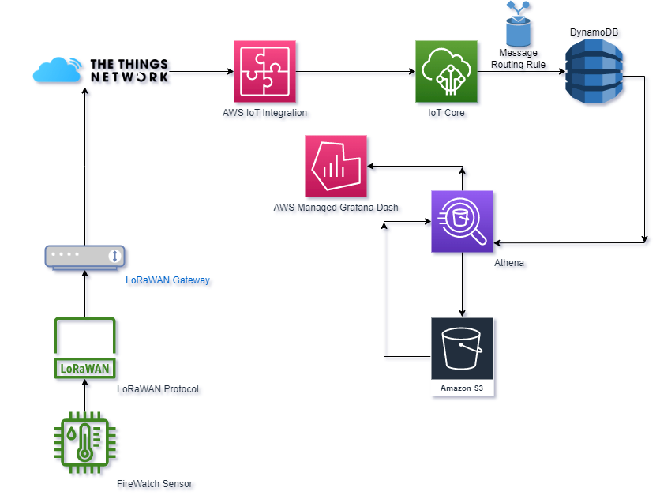

# Firewatch Cloud

This repository contains the code for the Firewatch Cloud, an IoT-based fire detection system utilizing LoRaWAN.

## Components Used

- **AWS IoT Core**: IoT Core is used to securely connect devices and send messages between them and other AWS services.
- **AWS S3 Buckets**: S3 Buckets are used to store queries from AWS Athena.
- **AWS Athena**: Athena is used to query the sensor data stored in the DynamoDB table.
- **AWS Lambda**: The Lambda function is used to process data that is sent from the AWS IoT Core and store it in the AWS DynamoDB database. 
- **AWS Managed Grafana**: Managed Grafana is used to visualize the sensor data collected by the Firewatch devices.
- **AWS DynamoDB**: DynamoDB is used to store data from the firewatch sensor.
- **AWS IAM**: IAM is used to manage access to AWS resources.
- **AWS Cloudwatch**: Cloudwatch is used to monitor the status of the Firewatch devices and the Lambda functions.
- **AWS CloudFormation**: CloudFormation is used to automate the deployment of the Firewatch Cloud infrastructure.
- **The Things Network**: The Things Network is used to securely transmit the sensor data collected by the Firewatch devices.

For more information on how each component is used, please see the respective folder in this repository.

### FlowChart

## License

This repository is licensed under the MIT License.

## Contributing

Contributions are welcome!